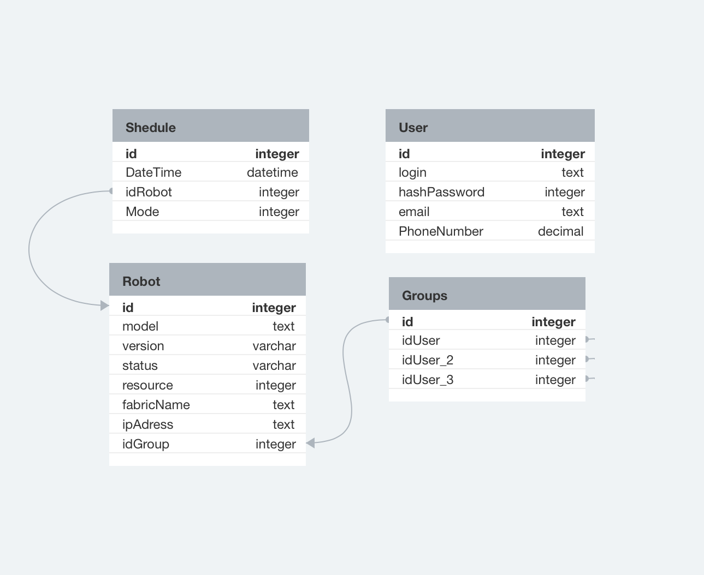
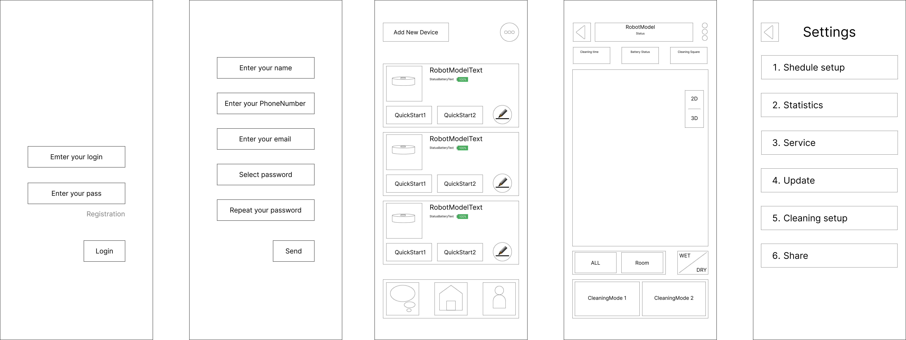
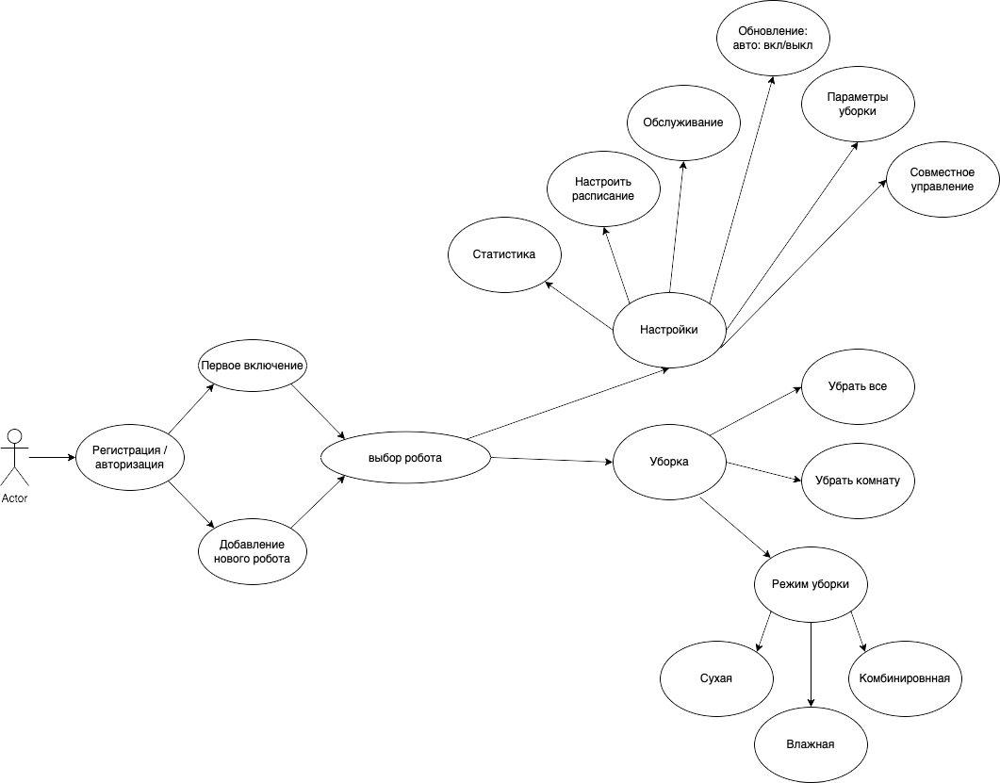

### Урок 10. Структура приложения с пользовательским интерфейсом и базой данных (паттерн Repository)
Доработать пункты задания Блока 1: a, b, c, d, e, f, g.

Задание: https://docs.google.com/document/d/1y5JSe2Vk64ed7c1IE6XRSYfMTzHGm7g2q-f0jRAo6eg/edit#heading=h.9uk02kr00e58

Инструменты:

https://www.figma.com/
https://app.diagrams.net/
https://www.dbdesigner.net/
https://swagger.io

